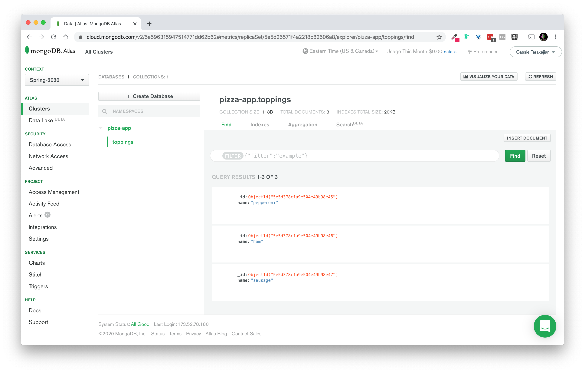
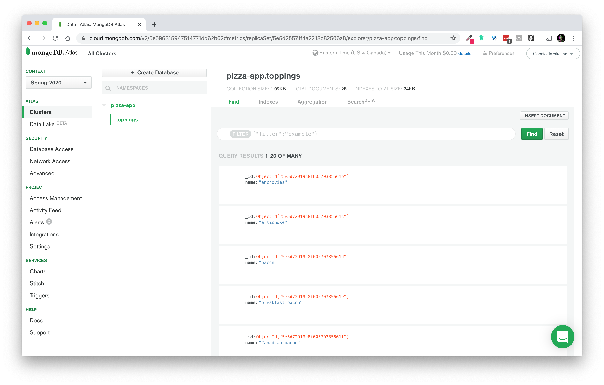

# Databases Workbook

This workbook accompanies Week 5 of the DWD class.

## Overview

### 00 Pizza Data Model
**Challenge**:
- Let's return to the Pizza toppings from the back end workbook
- Create a new data model, Pizzas, that has a name, and a list of toppings.
- Create a new data model, Orders, that contains a list of pizzas

**Solution**: [00_solution](./workbook/00_solution/)

### 01 Pizza Data Model, with reduced redundancy
**Challenge**:
- When you created the order data model, you likely copy and pasted a pizza from the list of pizzas in the Pizza model.
- What would happen if the toppings on a pizza changed? How would you update the orders that contain that pizza?
- How could you reduce redundancy? (Hint, use a unique identifier)
- What are different ways to create a unique identifier? Hint: Auto-increment, UUID, ObjectID
- Look at the URLs of website as you use them. For example, open your NYU email. How does the URL change when you click on an email?

**Solution**: [01_solution](./workbook/01_solution/)

### 02 Translating interfaces to data
**Challenge**:
- When creating web applications, the dynamic data that interfaces use is persisted most often in a database. When using a database like MongoDB, this data is simply in the form of JSON. Therefore, it's important to practice translating the state and data of interfaces into JSON. Translate the following web applications into a JSON data model.
  - [Simple Todo list](http://todomvc.com/examples/react/#/), [Solution](./workbook/02_solution/todo.json)
  - A Todo list with multiple lists, [Solution](./workbook/02_solution/todoLists.json).
  - A Todo list app with multiple users. Hint: It is best practice not to deeply nest data structures, but instead connect them via ids. Another hint: think about the interface, which would fetch all todo lists for a specific user. [Solution](./workbook/02_solution/todoUsers.json)
  - An Online News website, e.g. [The New York Times](nytimes.com)
  - Try your own!

### 03 Intro to NeDB
- NeDB is a JS library that has the same API as MongoDB, but it stores all of the data in a file so you don't need to install MongoDB
- Create a new JS file called `script.js`
- Create a new npm project by running `npm init`
- Install NeDB: `npm install --save nedb`
- Create a `.gitignore` to ignore your `node_modules` folder
- Import NeDB into your script with the line `const Datastore = require("nedb");`
- Create a file to store your database: `toppings.db`
- Create a new database with the line `const db = new Datastore({filename: "toppings.db", autoload: true})`
- Add a topping by looking at the [NeDB documentation](https://github.com/louischatriot/nedb). Documents stored in the data store must be objects, so you'll need to format it like { name: "pepperoni" }
- After inserting a topping, in the callback function, list all of the entires in the db with the line `db.find({}, (err, entries) => { console.log(entries); })`
- To test that it's working, run `node script.js`
- Open `toppings.db` and see what it looks like. Notice that it added a key called "_id".
- Delete the contents of `toppings.db`, then using `db.insert`, add two toppings by passing an array, then use `db.find({ name: "topping_name" })` to select one of them.

**Solution**: [03_solution](./workbook/03_solution/)

### 04 NeDB - Update and Remove
**Challenge**:
- Copy your code from Challenge 03.
- Update the `name` of one of the toppings, using the toppings's "_id" to select it.
- Then use `db.find()` to `console.log` the updated entries
- Then, use `db.remove` using a topping's "_id" to remove one.
- Then use `db.find()` to `console.log` the updated entries

**Solution**: [04_solution](./workbook/04_solution/)

### 05 Pizza Topping JSON -> NeDB
**Challenge**:
- Copy your code from Challenge 04.
- Copy pizzaToppings.json from the [Corpora GitHub](https://github.com/dariusk/corpora/blob/master/data/foods/pizzaToppings.json).
- Update `script.js` to load `pizzaToppings.json` into it, and then insert all of the pizza toppings values into the database. Be sure to delete all of the entries in the database to start. 

**Solution**: [05_solution](./workbook/05_solution/)

### 06 Pizza Topping API -> NeDB
**Challenge**:
- Update the Pizza Toppings API example to use NeDB
- Copy the code from [Challenge 16, Back end Foundations Workbook](https://github.com/itp-dwd/back-end-foundations-workbook/tree/master/workbook/16_solution)
- Copy `toppings.db` from the previous example.
- Delete `data/pizzaToppings.json`
- Install NeDB: `npm i --save nedb`
- Add the NeDB initialization to the top of `server.js`;
- Update the functions that were reading/writing to the JSON file to read/write to your database.
- To update these functions, you will need to add a callback function as an argument to `getToppings()`, `addTopping()`, and `deleteTopping()`
- Don't worry about fixing the front end to work with the data model changes. Use Postman to test the API changes.

**Solution**: [06_solution](./workbook/06_solution/)

### 07 Pizza Toppings API -> Adjust front end to work with API
**Challenge**:
- After changing the data model in Challenge 06 (now all of the toppings have unique IDs), we need to update the front end to work with the changes
- Copy all of your code from Challenge 06, and make it work!
- Because the API is no longer returning a list of all toppings from every API request, try storing the toppings an an array called `toppings` on the front end, and make changes/render from that array. For example, `GET /toppings` will set `toppings = response`, and `POST /toppings` will `toppings.push(response)`. This way, your front end has one source of truth, the variable `toppings`.

**Solution**: [07_solution](./workbook/07_solution/)

### 08 Pizza Toppings API - Front End Code Organization
**Challenge**:
- After getting your Pizza Toppings app to work end to end (browser to API to database), let's organize the front end code. There's a few different types of code, right? There's (1) code to render the list of toppings, (2) code that updates the underlying data structure, which the rendering code uses, (3) code that makes API requests, and (4) code that handles user events. 
- Refactor the code into:
  1. A data store, with a variable called `store` 
  2. functions to update the data store, that take the current state of the `store` and new data as arguments
  3. Functions that make `fetch()` requests to the API, and update the `store` when new data is received
  4. Functions that render the interface (the HTML), using the `store` to change their state
  5. Event handlers, that call the above functions on user action or page load.
- Hint: There's no right answer here. There's lots of design options and goals here. The goal here is to think about how to create small, reusable functions.

**Solution**: [08_solution](./workbook/08_solution/)

### 09 Pizza Toppings API - Fetch Error Handling
**Challenge**:
- Up to this point, our code assumes everything is running smoothly. But what if it's not? What if our browser can't connect to the API because of an Internet interruption? How do we handle errors gracefully and present them to the user without our whole application crashing?
- When making HTTP requests, sometimes the requests won't return a status of 200, sometimes it'll be 400 or 500. Sometimes the request will fail because of a break in connection to the Internet.
- Let's follow [this guide](https://alligator.io/js/fetch-api/) for handling errors. If `response.ok` is false, or there's a network error, we want to throw a JS error.
- Then, we'll `catch` the JS error from outside our API request functions, using the `Promise` `catch` method, rather than a `try..catch` block.
- You can test if this is working by running `npm start`, then opening the Developer Tools -> Network Tab -> Switch "Online" to "Offline". This will fake it, as though your site is no longer connected to the Internet.

**Solution**: [09_solution](./workbook/09_solution/)

### 10 Pizza Toppings API - Database Error Handling
**Challenge**:
- What if the database gets corrupted? What do we do if an operation fails? What if a user tries to delete a topping that doesn't exist? How do we send back different HTTP status codes to the front end?
- There will either be errors
  1. When connecting to the database.
  2. When doing database operations.
- We want to look at the `err` argument from the callback function, and return the right HTTP status code.
- [Take a look at the different HTTP status codes](https://www.restapitutorial.com/httpstatuscodes.html). We'll need to send these based on the type of error!
- First, we'll need to add
  ```js
    if (err) { 
      console.log(err);
      return res.status(500).json({ message: "Database error." })
    }
  ```
  Note that the `return` here is important to skip the rest of the function, that would send by JSON if there weren't an error.
- Then, in the `POST /toppings` request, we'll need to check the user data. Those will return 400 errors.
  ```js
    app.post("/toppings", (req, res) => {
      const topping = req.body.topping;
      if (!topping) {
        return res.status(400).json({ message: "Missing \"topping\" attribute from request body."});
      }
      //...
    });
  ```

- We'll also need to check the data passed to the `DELETE /toppings/name` request:
  ```js
    app.delete("/toppings/:name", (req, res) => {
      const toppingToDelete = req.params.name;
      deleteTopping(toppingToDelete, (err, numDeleted) => {
        if (numDeleted === 0) {
          return res.status(404).json({ message: `Topping with the name "${toppingToDelete}" does not exist.` });
        }
        // ...
      });
    });
  ```

- Lastly, let's handle an error connecting to the database, so the server doesn't crash:
  ```js
    const db = new Datastore({ 
      filename: "toppings.db",
      autoload: true,
      onload: (err) => {
        if (err) {
          console.log(err);
        }
      }
    });
  ```

**Solution**: [10_solution](./workbook/10_solution/)

### 11 Registering for MongoDB Atlas
**Challenge**:
Now that we're familiar with NeDB, we can move on to MongoDB. We're going to use a service called MongoDB Atlas.
- Follow the [Database Services Guide](https://github.com/itp-dwd/2020-spring/blob/master/guides/database-services-guide.md#mongodb-atlas) to register for a MongoDB Atlas account and create a free tier cluster.

### 12 Connecting to your Mongo Database
**Challenge**:
Write a Node script that connects to your Mongo database. We're first going to play around with connecting to the database, and then connect it to our pizza toppings example.
- Make sure you have created a username and password for your cluster
- Create a new file called `script.js`
- Run `npm init`
- Run `npm install --save mongodb` to add the npm library to connect to your mongo database
- Run `npm install --save dotenv` so that we can hide the mongo connection url from git
- Create your `.env` file and your `.gitignore` file
- Get your Mongo Connection string by clicking the "Connect" button in your cluster, then "Connect Your Application", then choose your connection method as "Node.js". Copy the text that appears as "Connection String Only" and put it into a variable in your `.env` file as `MONGO_URL`. You'll have to manually enter in the password.
- Then, click on the "Full Driver Example" tab and copy all of that code, and paste it into `script.js`
- Replace the value of `uri` with `process.env.MONGO_URL`
- In the `client.connect` callback function, add code that checks if there is an `err`, and if so, `console.log` the value
- Run `node script.js` to make sure it is all working.

### 13 Mongo Operations
**Challenge**:
Let's play around with the Mongo API to understand how we work with data and do the things we want to do with it (CRUD: Create, Read, Update, and Delete)
- Copy your code from Challenge 12.
- Go to the [documentation](http://mongodb.github.io/node-mongodb-native/3.5/) for the `mongodb` npm library. 
- Click on the "Quick Start" guide. Note that this quick start guide is assuming you have mongo installed on your computer, and therefore the connection string is different.
- Notice the different terms.
  - **Cluster**: The root of your Mongo URL. Think of this like a server computer. A cluster can have many databases.
  - **Database**: A collection of data relevant to one application, which usually has the same name as your application. For example, the p5.js Web Editor has a Mongo database called "p5js-web-editor".
  - **Collection**: sub-organization for your web application data. For example, in the p5.js Web Editor, there are collections called "users" and "sketches". 
  - **Document**: one entry in the collection
- Let's call our database "pizza-app". Create a variable `const DB_NAME="pizza-app"`; You'll use this in `client.db(DB_NAME)`. 
- Then, we're going to be connecting to the "toppings" collection. You can connect to a db/collection before you've added anything to it.
- Change the line that creates a variable called "collection" to 
  ```js
  const Toppings = client.db(DB_NAME).collection("toppings");
  ```
  Notice that the variable is capitalized—this is a convention when working with Mongo collections in Node.
- Then, let's insert some data into the database:
  ```js
  // insert one
  Toppings.insert({name: "pineapple"}, (err, result) => {
    if (err) {
      console.log(err);
    }
    console.log(result);
  });

  // insert multiple
  Toppings.insertMany([
    {name: "pepperoni"}, {name: "ham"}, {name: "sausage"}
  ], (err, result) => {
    if (err) {
      console.log(err);
    }
    console.log(result);
  });
  ```
- Now, let's run this operation by running `node script.js`
- To check that you inserted some data, let's open up the Atlas Cluster Admin Panel and click on "Collections". You should see something like this:
  
- Now, let's try listing this data from Node. Comment out all of your insertion code and add the following:
  ```js
  // You must use the method `toArray` to look at the documents
  Toppings.find({}).toArray((err, result) => {
    if (err) {
      console.log(err);
    }
    console.log(result);
  });
  ```
  Run `node script.js` to see the results.
- Let's delete one of the toppings. Say I want to remove "pepperoni":
  ```js
  Toppings.deleteOne({name: "pepperoni"}, (err, result) => {
    if (err) {
      console.log(err);
    }
    console.log(result);
  });
  ```
  Run `node script.js` to see the results.
- Yay! Now we're using Mongo!

### 14 Pizza Topping JSON -> MongoDB
**Challenge**:
Insert the pizza toppings in pizzaToppings.json to a Mongo database.
- Copy your code from Challenge 5.
- Go onto MongoDB Atlas and clear all of the entries from your "toppings" collection.
- Uninstall `nedb`
- Delete `toppings.db`
- Install `mongodb`
- Install `dotenv`
- Copy your `.env` from Challenge 13.
- Add `.env` to your `.gitignore`
- Copy your code from Challenge 13 to connect to the MongoDB.
- Merge your code from Challenge 05 and Challenge 13 to read from the pizzaToppings JSON file to MongoDB
- Run `node script.js` to insert the data
- Go to MongoDB Atlas to confirm the data is in your database.
  


### 15 Converting Pizza Toppings API to Mongo
**Challenge**:
Convert the Pizza Toppings API to use MongoDB instead of NeDB.
- Copy your code from Challenge 10.
- Uninstall `nedb`
- Delete `toppings.db`
- Install `mongodb`
- Install `dotenv`
- Copy your `.env` from Challenge 13.
- Add `.env` to your `.gitignore`
- Copy your code from Challenge 13 to connect to the MongoDB.
- Replace all of your `insert`/`find`/`delete` code from point to NeDB to point to Mongo.
- Note that you'll only need to change the DB connection, and the functions `addTopping`, `getToppings`, and `deleteTopping`
- Run the server by running `npm start` and test that it all works!